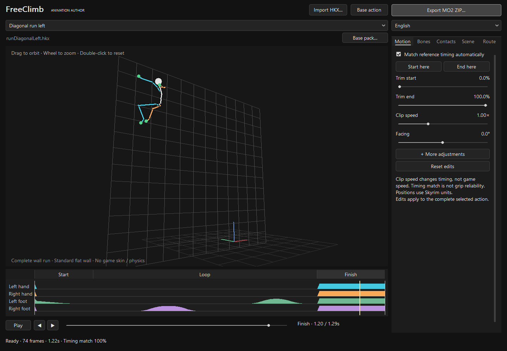
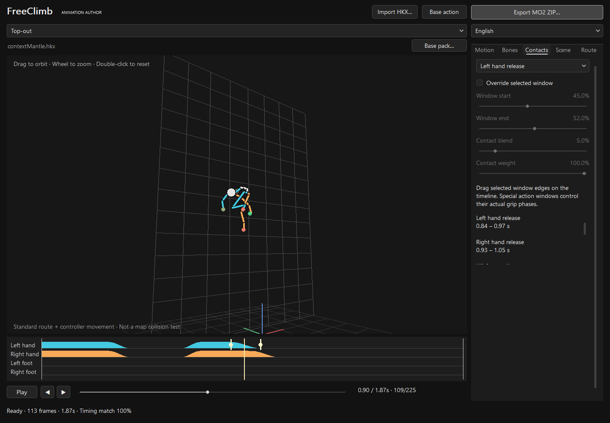

# FreeClimb Animation Tool

English | [简体中文](README.zh-CN.md)

**Import an HKX, preview it, make adjustments and export an MO2 package in one window.**

Over the past week, I tried several ways to move the current animation playback to the game’s native Havok system. With my current experience, those attempts did not produce satisfactory results.

For FreeClimb, controlling the skeleton directly through the DLL may currently be the best option. I would appreciate help from anyone able to migrate the existing climbing logic to the native behavior graph.

The workflow below converts standard HKX animations into the “HKX” format FreeClimb can read. This is a compromise for the current implementation.

## Quick start

1. Extract the complete source archive and open **`FreeClimbConverter.exe`**. Choose **your own HKX animation** and the FreeClimb slot to replace, then load it.
2. **Preview first.** Play, pause, scrub, orbit and zoom. Wall runs show the complete start, run and ending by default.
3. **Export a ZIP.** Install it after FreeClimb in MO2's left pane so it overrides the base mod, then test in-game. No Pandora/Nemesis generation is needed.

The tool exports one HKX and one action JSON to install and replace the corresponding FreeClimb action.

The default ZIP name is `SourceName-FreeClimb-TargetAction.zip`. The action selected in the tool determines what is replaced, regardless of the ZIP name.

**Read on if you need more detail. Otherwise, you can stop here.**

------

Each wall-run direction has its own HKX containing the complete start, loop and ending, plus one JSON.

- **Edit a base action:** select its direction and click **Base action**. Preview and adjust the complete action; its existing loop range loads automatically.
- **Use your own complete wall run:** select the direction, import the HKX and mark the loop's start and end. The preceding section is the start, and the following section is the ending. The tool processes these automatically; export the ZIP when ready.

For a 3-second action with a loop from 0.5 to 2 seconds, the first 0.5 seconds is the start, the middle 1.5 seconds is the running loop, and the final second is the ending. The loop's end poses should match closely. Each section needs at least two frames inside the retained trim range. The tool cannot guess a new animation's loop boundaries.

A complete file is limited to 10 seconds and 1201 frames.

**Use Import HKX to replace an animation, and install the complete exported package.** External imports use source playback without the base clips' special bracing arms, flip takeoff/landing splices or entry trimming. Overall wall placement, contact adjustment and safety limits still apply. Replacing only the HKX while retaining base JSON keeps the base processing and may alter the replacement pose, so replace the HKX and JSON together.

**External HKX overrides and the new wall-run timeline configurations require the matching FreeClimb 0.4.0 DLL and cannot be used with 0.3.0.** Install matching HKX, JSON and DLL files together. The tool writes configurations automatically; no manual JSON editing is needed.

Windows x64 requires the Microsoft Visual C++ v14 x64 runtime. **Python, Blender, the Havok SDK and a compiler are not required.**



Inspect the bone animation on the left and play or scrub below it. Adjustments on the right are optional; export is at the top right. Hover over a filename to see its full path. Check the in-game result after export.

Imported HKX files preview their own animation and source movement, and complete wall runs play through the whole file. Base actions include their existing game-route adaptation. Real map collision, character skins and clothing physics still require in-game checks.

## Adapting existing HKX files

Use **Skyrim SE animation HKX files already adapted to the Skyrim humanoid rig**. Suitable existing animations can be tried directly in the converter.

- SE 64-bit Havok 2010.2 animation, interleaved or spline-compressed; normally one animation and its binding per file.
- Binding name `NPC Root [Root]`. Common standard track layouts and complete standard bone-name mappings are handled automatically. No manual conversion to FreeClimb's bone count is needed.
- Ordinary full-body animation, not additive; duration greater than zero and at most 10 seconds, with at most 1201 sampled frames. Valid single-frame static poses are expanded to two frames automatically.

FBX files, other game rigs and creature animations require adaptation in animation software first. LE 32-bit HKX, behavior graphs and `skeleton.hkx` are not animation inputs.

Source `animmotion` / `animrotation` and extracted root motion are **baked into Root once**, for preview and export. When both are present, AMR replaces the matching translation / rotation channel instead of adding the two. Reimporting a converted file does not bake it again. Trimming resamples at no less than 120 Hz in source time, up to 1201 frames.

**In-game, all active actions support source playback.** Idles loop on their own clock. Climbing and wall-running cycles advance with actual movement, deriving stride from real net Root displacement when present and retaining the base stride otherwise. Entry, grabs, side leaps, mantles and exits retain complete clip timing. Root travel is adapted to a collision-checked route; in-place clips use the action’s safe route. The status distinguishes “Root movement” from “in-place.”

Mantles first try the fitted source movement. If it moves forward too early and hits the ledge, FreeClimb tries a collision-checked route that rises before crossing, paced by the source movement without changing clip duration. Insufficient headroom or landing support still prevents a mantle. One-shot Root paths that move out and return to their starting point also participate in collision checks; no manual JSON change is needed.

| Issue | Available adjustment |
| --- | --- |
| Unwanted waiting at either end | Trim the start and end |
| Unsuitable clip timing or facing | Clip speed, facing and body offsets |
| A joint needs a small correction | Select the bone, rotation and affected interval, with smooth fades |
| Limb support timing does not fit | Inspect the timeline; external imports allow per-limb contacts, while base actions retain their special grip windows |
| An in-place variant is needed | Remove net movement per axis; normally keep Root travel and let the tool adapt it |
| Stride or reference distances differ | External animations adapt from source Root movement; geometry controls remain available when loading a base slot |

These are optional adjustments, not a checklist required before every export. Changes recompute the preview, and export uses the edited result. Bone rotations have angle and time-interval limits.



In this base-mantle example, the four timeline rows represent the left hand, right hand, left foot and right foot. Taller colored regions mean greater support weight; the light line is the playback position. Select **Left hand release** to see its two transition markers. Only if adjustment is needed, enable **Override selected window** and drag the markers. Externally imported mantles use per-limb contact curves instead of these base-action windows.

Clip speed changes time in the animation data. Imported idles and one-shot actions use the complete clip duration. **Movement cycles follow travel distance and stride; clip speed is not game movement speed.**

## Control reference (read as needed)

**Units and scope:** A phase is a fraction of the whole animation: 0 is the start, 0.5 the middle and 1 the end. For a 2-second clip, 50% is 1 second. Trim percentages refer to the original clip; other phases refer to the trimmed clip. Distances use Skyrim units, not meters. In the reference coordinates, X is left/right (+X right), Y is forward/back (+Y toward the wall), and Z is vertical (+Z up). Orbiting the camera does not change these axes.

**Motion** and **Bones** edit the exported HKX; **Contacts** and **Route** edit its paired JSON. **Scene** and playback controls affect preview only.

### Files, slots and playback

| Control | Purpose |
| --- | --- |
| Import HKX | Load one animation to convert. You can also drop one `.hkx` file into the window. |
| Action slot list | Choose the complete in-game action and its reference configuration. Selecting a climbing slot does not turn an unrelated idle into climbing. |
| Base action | Open the selected action from the base pack itself, useful for inspecting or adjusting a bundled animation. |
| More adjustments / Compare original pose | Optional loop boundaries and position controls. Base actions also offer original-pose comparison; imported actions already show their source animation without switching modes. |
| Loop start / end · input time (s) | The two boundaries in a complete imported wall run. Enter seconds or mark them on the timeline; edits update automatically. Existing actions load their original boundaries. |
| Base pack | Select the complete FreeClimb `pack.json`, not an individual action JSON. Import or load the base slot again after changing this path. |
| English / 简体中文 | Change the tool's interface language without changing the animation. |
| Export MO2 ZIP | Export the current complete action's HKX and JSON. Wall runs and contextual leaps export independently by direction. Pending or invalid edits block export; check the status message. |
| Play / Pause, ◀ / ▶ | Play or pause; the arrows step one frame at a time. Playback stops at the end; pressing Play again restarts it. |
| Playback slider / timeline | Seek to a time. Single clips show seconds and frame counts; a complete wall run shows total sequence time and Start / Loop / Finish markers. Seeking does not trim or edit the file. |
| Preview mouse controls | Left-drag horizontally or vertically to orbit, wheel to zoom, double-click to reset the view. Scroll the right panel if its controls extend below the window. |
| Bottom status bar | Shows one line, with an ellipsis for longer text. Hover to read the complete status or warning. |

### Motion: trimming, speed and overall pose

Available for every slot. Changes update the skeleton preview and are included in the exported HKX.

**More adjustments** is collapsed by default. It contains existing wall-run loop boundaries, Root / COM offsets and In-place X / Y / Z switches; base actions also offer original-pose comparison. Ordinary replacements need not expand it; collapsing it does not change your edits.

| Control | Range / unit | Use |
| --- | --- | --- |
| Match reference timing automatically | On / off; on by default | Match contact timing against reference poses. Base slots retain their original timing when off. External animations start with zero limb contacts when disabled or below a 90% match; contacts remain editable. The match percentage is not a wall-grab success rate. |
| Start here / End here | Current playback position | Set the trim boundary quickly. Pause on the first or last frame you want to keep, then press the corresponding button. |
| Trim start / Trim end | 0–100% of original clip | Keep the section between these boundaries; the end must follow the start. This removes unwanted preparation or recovery but does not create new transition poses. |
| Clip speed | 0.5–2× | 1 is original speed, 2 halves the clip duration, and 0.5 doubles it. This is not the player's in-game climbing speed. |
| Facing | −180° to 180° | Rotate the entire clip around Z to correct its orientation. Positive rotation goes from +X toward +Y, counterclockwise when viewed from above. |
| Root X / Y / Z | −100 to 100 per axis | Add a constant position offset to the root throughout the clip. Negative values move along the opposite axis direction; the movement curve over time is unchanged. |
| Body X / Y / Z | −30 to 30 per axis | Offset the body center (COM) while leaving the root unchanged. Use for small placement adjustments, not bone-length changes. |
| In-place X / Y / Z | Independent axis switches | Remove the **linear start-to-end body displacement** on each enabled axis while retaining arcs and local motion. For example, check In-place Y if the clip already travels forward and the game also supplies forward movement. This does not lock every frame in place. |
| Reset edits | All edits | Clear trim, speed, pose, contact and route edits for the current animation and restore the loaded state. The input file is unchanged. |

Root and body offsets edit the animated pose. The game still adapts the character to real surfaces, contacts and collision; these offsets do not directly set the player's movement route.

External routes are generated from the edited Root movement. Importing or trimming resets the first Root position to zero before applying Root offsets; local limb poses stay unchanged. Local COM crouching remains a pose, not guessed player travel. If large travel exists only in COM without identifiable Root movement, export is rejected; move character travel into Root when exporting from the animation application.

### Bones: small local rotation corrections

Select a bone before adjusting it. Corrections affect the selected interval and are written into the HKX without changing bone lengths. Use this for small wrist or elbow adjustments, not full rig retargeting.

| Control | Range / unit | Use |
| --- | --- | --- |
| Bone list | Current skeleton | Select and highlight a bone. Protected camera, equipment, magic-effect and other engine-owned helper bones can only be inspected. |
| Local rotation X / Y / Z | −45° to 45° per axis | Add a local rotation to the original animation; the combined rotation is limited to 60°. These axes follow the bone. Identical values on the left and right hands may not produce mirrored corrections, so inspect the preview while adjusting. |
| Window start / Window end | 0–100% of animation | Define when the correction applies. The original animation is retained outside this interval. |
| Blend width | 1–30% of animation | Fade length at each end of the interval. Larger values give gentler transitions. It cannot exceed half the window length: a 20–60% window allows at most 20%. |
| Clear bone correction | Selected bone | Remove only this bone's correction, retaining other bone and page edits. |

The window must have a positive length. If the status reports that an edit cannot be applied, widen the window or reduce blend width / rotation, then check that the preview updates.

### Contacts: when to grip and release

Select a limb or special window, enable **Override selected window**, then adjust it. Clearing the checkbox removes only that override and restores automatic or base timing. All phases are 0–100% of the animation. The DLL uses these settings for support and route handling; **they do not create new hand or foot movement inside the HKX**.

| General contact control, including external imports | Purpose |
| --- | --- |
| Left hand / Right hand / Left foot / Right foot | Select a support curve. Each limb is adjusted separately. |
| Window start / Window end | Blend the original support weight toward the chosen value within this interval. Preserve the original curve outside it. |
| Contact blend | Transition width at both ends, from 1–30%, limited to half the window length. Larger values give gentler transitions. |
| Contact weight | 0–100%. Zero requests no support from this limb; 100% requests full support. External imports require a real nearby surface and bounded IK for each support. Without a valid contact, the source pose stays unchanged. Base actions retain their existing contact rules. |

In the base pack, `kickUp/Left/Right`, `dropBack`, `backFlipOut` and `runLaunch` use dedicated action handling rather than ordinary contact weights to pin limbs. Editing their ordinary curves does not change in-game gripping or release behavior.

Base `contextHopLeft` / `contextHopRight` use special windows instead of the ordinary **Contact blend / Contact weight** controls:

| Side-leap window | Purpose |
| --- | --- |
| Left / Right hand takeoff | Release the original grip gradually, beginning at the start of the interval and finishing at its end. |
| Left / Right hand catch | Acquire the target grip gradually, beginning at the start and reaching full target support at the end. |
| Vertical path blend | Gradually apply the actual height difference between departure and destination. It must start after both hands have released and finish before either hand starts catching. Additional arc height comes from Route → Lift. |

The bundled base pack's `contextMantle`, opened through **Base action**, uses the following mantle windows. Externally imported mantles use the per-limb contacts above:

| Mantle window | Purpose |
| --- | --- |
| Lift from wall | Gradually release the original wall grip before transferring support to the top. |
| Plant on ledge | Gradually establish hand support on the top, after Lift from wall. |
| Ledge pose sample | Select **one instant** used to calculate reference palm placement on the top. Adjust Window start; Window end is unavailable. This instant must lie inside Plant on ledge. |
| Left / Right hand release | Gradually end each hand's support after the body comes onto the top. Both intervals must start after Plant on ledge ends. |

The special-window summary also shows times in seconds. The four colored timeline rows show support weights, and the white line shows playback time. Dragging a selected window's boundary markers also enables that override automatically. Match grip/release timing to when the palms actually arrive and leave in the animation.

### Scene: viewing references only

**Every setting on this page affects display only. None is exported, and none changes in-game surfaces, contacts or movement.**

| Control | Range / unit | Purpose |
| --- | --- | --- |
| Wall reference | On / off | Show a grid wall for checking placement. |
| Ledge reference | On / off | Show the wall's upper edge and top surface. |
| Show all bone links | On / off | Include additional helper-bone links; when off, show mainly the body skeleton. |
| Wall position | Y: −100 to 200 | Move the grid wall in source preview. Adapted preview uses a fixed standard wall; moving a reference cannot substitute for correcting wall placement. |
| Ledge height | Z: 0–300 | Set the top surface height in source preview. Mantle preview shows the simulated platform height; wall-run preview has no top ledge. |
| View yaw | −180° to 180° | Orbit the viewing camera; the animation itself does not turn. |
| View pitch | −65° to 65° | Change viewing elevation. Positive values look upward from below; negative values look downward from above. |
| Fit / reset view | Button | Fit the whole animation in view and restore the default viewing direction. |

### Route: distances and paths used by the game controller

Imported previews show source movement without adding the base route; settings on this page affect in-game route adaptation. An in-place moving cycle's stride does not become HKX source movement. Real-surface distances, support and collision need in-game checks. Parameters unused by the selected action are disabled.

External imports derive routes from source movement. Movement cycles with real net Root travel calculate stride automatically; in-place movement cycles start with the base stride and allow editing **Stride** to reduce foot sliding. Other geometry fields remain automatic. The full controls below apply to **Base action**.

| Control | Range / unit | Actual effect and applicable slots |
| --- | --- | --- |
| Stride | 0–500 | Distance traveled per climbing / wall-running loop. A larger stride plays fewer cycles at the same movement speed. Values above 1 advance by traveled distance; otherwise the loop advances by clip time. This is not maximum climbing distance. External in-place movement cycles also expose this field. Used by base `hang`, `up/down/left/right/contextHang` and the five `runUp/Left/Right/DiagonalLeft/DiagonalRight` loop slots. |
| Height | −500 to 500 | The base `contextMantle` reference rise, used to adapt the pose to the actual top. It is not the tallest climbable wall. Imported mantles generate this value automatically. |
| Travel X | −500 to 500 | Reference side-leap distance: below −40 for `contextHopLeft`, above 40 for `contextHopRight`. The mantle slot uses it to compensate authored lateral drift. Other current slots do not use it to set movement distance. |
| Travel Y | −500 to 500 | Authored forward reference distance for `contextMantle`, positive into the wall / onto its top. Other current slots do not use it to set a route. |
| Travel Z | Not editable | The current DLL does not use this field to control movement, so it remains disabled. Do not use it to adjust jump or mantle height. |
| Knot list | Side-leap route knots | Select a point in route time. For example, `3 · 50%` means knot 3, halfway through the animation. |
| Knot phase | 0–100% | When this knot occurs: 50% is halfway through the animation. Times must increase and cannot cross neighboring knots. |
| Path progress | −25% to 150% | Fraction of horizontal movement from departure to destination: 0% is the departure, 50% halfway, and 100% the destination. Negative values move back first; values above 100% overshoot before returning. This is not a time in seconds. |
| Lift | −32 to 96 | Extra vertical offset in addition to the start-to-target height change. Positive values raise the arc; negative values lower it. This is not a constant Z offset for the entire action. |
| Out from wall | 0–48 | Extra offset away from the wall along its outward normal at this time. Larger values make the leap leave the surface more visibly; collision checks still apply. |
| Simplify route for editing | Available above 64 knots | Resample a dense route to 33 knots while retaining endpoints. Simplification occurs only when clicked and may change local curve shape, so inspect the result. |

The four knot controls apply only to the two `contextHop` side-leap slots. The first knot is fixed at phase 0%, progress 0%, lift 0 and outward offset 0. The last is fixed at phase 100%, progress 100%, lift 0 and outward offset 0, keeping departure and landing on their verified anchors. Values interpolate smoothly between interior knots.

For example, in a 2-second side leap, set an interior knot at phase 50% to progress 60%, lift 15 and outward offset 8. At 1 second, the route has covered about 60% of the horizontal distance, with 15 units of extra height and 8 units away from the wall. **These side-leap knots do not control mantles; an imported mantle's route follows its edited animation automatically.**

## What automatic adaptation does

The tool matches reference support timing using pose changes. Base actions retain reference timing when the match is poor. External imports default to unlocked limbs and source playback; add support on **Contacts** if needed. **Reference matching does not detect real wall contact.**

Source Root curves are written with `authoredPlayback.basis: "root"`. The controller adapts compatible travel to the actual route; local movement not consumed by player travel remains in the pose. Idles loop on their own clock instead of freezing the preceding climbing pose. In-place one-shot actions also keep their complete clip, using the existing safe route. Entry and movement validate the same body collision path; an animation cannot bypass walls or invent handholds. Actual leap and mantle distances follow verified destinations, so adapting a route does not preserve an unsuitable source travel distance exactly.

Imported previews directly show baked source movement and edited bone curves, without requiring a successful grab or mantle on a virtual wall. Splitting a complete wall run does not change its whole-file preview. Base wall runs and mantles use a standard wall/platform with the DLL's route and pose handling. In-game playback still fits source routes to real targets and checks collision. Bone-length and scale normalization can change endpoints such as fingers. Check entry, playback and exit in-game after export.

<details>
<summary>Format details, command line and build</summary>

Ordinary joint translations and scales are normalized to FreeClimb's reference rig. Missing tracks use the reference pose; extra bones are not output. Files without names or indices are interpreted using supported standard bone orders and reported as such. Custom orders should be exported with complete names or correct indices. Extra float channels are read, discarded and reported.

Source annotations and extracted root motion are retained after baking. A bake marker prevents repeated application; other annotations are not dispatched as native events. External imports use `FreeClimbClip` version 2 with `authoredPlayback`; base clips retain version 1 playback rules. Each wall-run and contextual-leap direction uses its own `FreeClimbActionGroup` version 2 configuration, with `direction`, `frameRange`, `rootShift` and `sequences` describing that action's stages. Required bracing references also stay inside the current action's file. Group format and clip playback version are separate. These new formats require the matching 0.4.0 DLL. Export validates the complete pack with the production loader. Reload the document if its input or base pack changes while editing.

The command-line converter uses the same import, source-motion baking and automatic adaptation as the GUI, without manual slider edits:

```powershell
.\bin\FreeClimbHKXConverter.exe convert --input "D:\Animations\myClimb.hkx" --slot up --pack "D:\FreeClimb\pack.json" --output "D:\Output\MyClimb.zip"
```

Use `--overwrite` to replace an existing ZIP. Build from the source root:

```powershell
cmake -S . -B build-converter -DFREECLIMB_PLUGIN=OFF -DFREECLIMB_AUTHORING_TOOLS=ON
cmake --build build-converter --config Release --target FreeClimbConverter FreeClimbHKXConverter
```

See the [animation reference](../../docs/ANIMATION-DIY.md) for slots and data fields.

Original tool code uses GPL-3.0, as specified by the root `LICENSE`. Third-party components and animations retain their own licenses.

</details>
