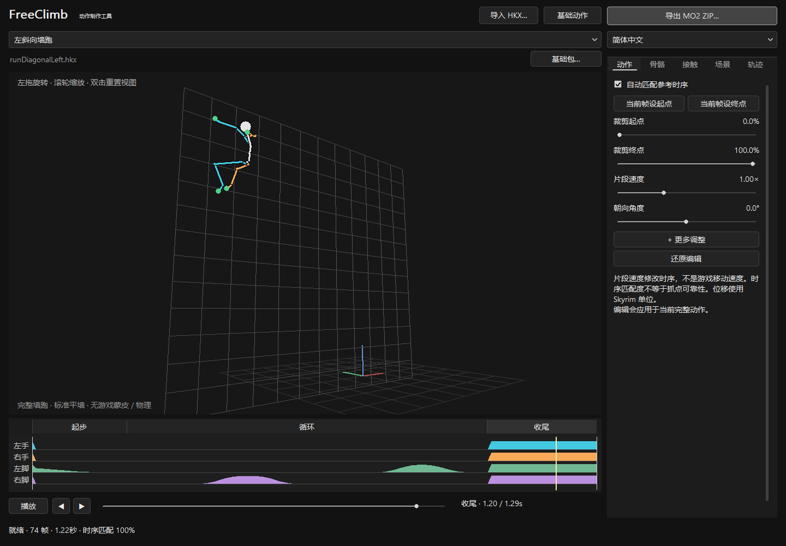
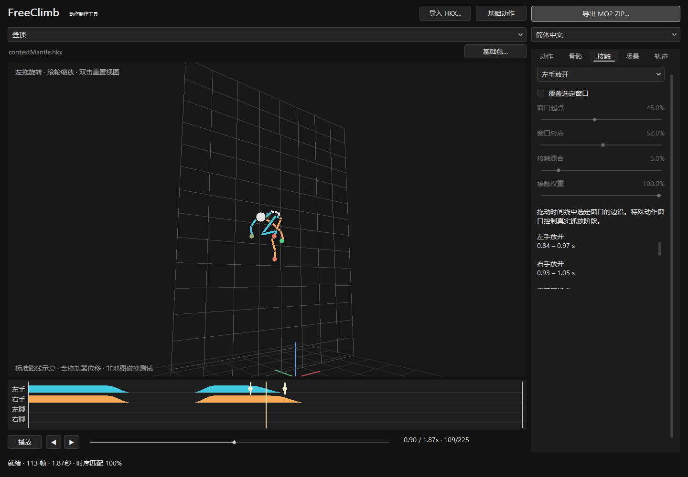

# FreeClimb 动作工具

[English](README.md) | 简体中文

**在一个窗口里导入 HKX、播放预览、微调动作、导出 MO2 安装包。**

我在过去一周内已尝试过各种方式，将现有移动方式转换至游戏原生havok，但因能力有限，均以失败告终，效果很不理想。

目前对于FreeClimb来说，或许直接用dll控制骨骼是最佳方式。如果有人能将目前的攀爬逻辑迁移至游戏原生行为图，将不胜感激。

下面的流程，主要用于将标准hkx动作文件，转换为FreeClimb能读取的“hkx”格式，这也是目前不得已的妥协。

## 怎么用？

1. 解压完整源码包，打开 **`FreeClimbConverter.exe`**。选择 **你自己制作的HKX** 和要对应替换的FreeClimb插槽，然后载入。
2. **先看预览。** 可以播放、暂停、拖动时间轴、旋转视角和缩放；墙跑默认播放完整的起步、跑动和收尾。
3. **导出 ZIP。** 安装到 MO2，放在左侧 FreeClimb 之后覆盖，再进游戏检查。无需刷新 Pandora／Nemesis。

工具将导出一个 HKX 和一个动作 JSON，用于安装并直接替换 FreeClimb 对应动作。

ZIP 默认命名为“源文件名-FreeClimb-目标动作.zip”。替换哪个动作由工具中的动作选择决定，与 ZIP 名称无关。

每个墙跑方向都是一个独立 HKX，内部包含完整的起步、循环和收尾，配套一个 JSON。

- **修改现有动作：** 选择方向，点“基础动作”，直接预览和调整完整动作。已有循环范围自动载入。
- **换成自己的完整墙跑：** 选择方向，导入 HKX，然后标出**循环开始和结束的位置**。其前面是起步，后面是收尾；工具自动处理，最后导出 ZIP。

例如动作共 3 秒，循环范围为 0.5–2 秒：开始的 0.5 秒用于起步，中间 1.5 秒用于持续墙跑，最后 1 秒用于收尾。循环首尾姿势应接近，三个部分都需至少两帧，并位于保留的裁剪范围内。**工具不能自动猜出一个动作的循环范围**。

完整文件最多 10 秒、1201 帧。

**替换动作请用“导入 HKX”，并安装完整导出包。** 外部导入自动使用源动作模式，不套用基础动作的扶墙手臂、翻转起落拼接或截取起手等专用处理。整体贴墙定位、接触调整和安全限制仍会生效。只换 HKX、沿用基础 JSON，会继续使用基础动作的处理方式，可能改变新动作的姿态，所以需要HKX和JSON一起替换。

**外部 HKX 转换包及新的墙跑时间轴配置都需要配套 FreeClimb 0.4.0 DLL，不能用于 0.3.0。** 请同时安装匹配的 HKX、JSON 和 DLL；工具自动生成配置，无需手写。

Windows x64 需要 Microsoft Visual C++ v14 x64 运行库。**不需要 Python、Blender、Havok SDK 或编译工具。** 



左侧看骨骼动作，下方播放或拖动时间；右侧是可选微调，右上角导出安装包。文件名上悬停可查看完整路径。导出后再检查游戏中的效果。

导入 HKX 后，预览显示它自己的动作和源位移，完整墙跑按整段文件播放。载入基础动作时，预览包含其已有的游戏路线适配。实际地图碰撞、角色蒙皮和衣服物理仍需进游戏检查。

**需要更多细节，请看后续内容。否则已可结束**。

------


## 如何适配现成HKX

使用**已经适配 Skyrim 人形骨架的 SE 动画 HKX**。现成且合适的动作可以直接尝试转换。

- SE 64 位 Havok 2010.2 动画，interleaved 或 spline 压缩；通常一个文件包含一个动画和绑定。
- 绑定名为 `NPC Root [Root]`。常见标准轨道，以及带完整标准骨名的轨道映射可自动处理，无需改成FreeClimb的骨骼数。
- 普通全身动作，非 additive；时长大于 0、不超过 10 秒，最多 1201 个采样帧。合法的单帧静态姿势会自动补成两帧。

FBX、其它游戏骨架、动物动作需要先在动画软件中适配。LE 32 位 HKX、行为图和 `skeleton.hkx` 不能作为动画导入。

源动作的 `animmotion`／`animrotation` 和提取根运动会**一次性烘焙到 Root**，参与预览与输出。两类数据同时存在时，AMR 优先覆盖对应位移／旋转通道，不叠加两份；重新导入已转换文件也不会重复烘焙。裁剪按原片段时间至少 120 Hz 重新采样，最多 1201 帧。

**游戏中，所有有效动作都支持源动作播放。** 待机按自身时长循环；攀爬和墙跑循环按实际移动距离推进，有真实 Root 净位移时自动计算步幅，没有时沿用基础步幅。起手、跃抓、侧跃、登顶和离墙保留完整片段时序，有 Root 行程时适配经过碰撞检查的路线，原地动作则使用该动作的安全路线。状态栏会区分“Root 位移”和“原地动作”。

登顶优先适配源位移；如果源动作过早向前移动而撞到台沿，则尝试经过碰撞检查的抬升、跨沿路线，按源动作的行进节奏播放，不改片段时长。顶部空间或落脚点不足时仍会拒绝登顶。单次动作中途移动再回原位的 Root 轨迹也参与检查；无需为此手改 JSON。


| 问题 | 可用调整 |
| --- | --- |
| 开头、结尾有多余等待 | 裁剪起止时间 |
| 片段节奏或朝向不合适 | 片段速度、朝向和身体偏移 |
| 某个部位角度需要小修 | 选择骨骼，设置旋转和作用时段；两端平滑过渡 |
| 手脚支撑时机不合适 | 查看彩色时间线；外部导入动作可逐肢体编辑接触，基础动作保留专用抓放窗口 |
| 需要把有位移动作改成原地版 | 可按轴去除净位移；通常保留 Root 行程让工具自动适配即可 |
| 步幅或参考距离不同 | 外部动作由源 Root 自动适配；载入基础槽位时仍可使用几何设置 |

以上都是可选微调，不是导出前必须完成的清单。修改后重新计算预览，导出使用编辑后结果。骨骼旋转有范围和时段限制。



以基础登顶为例：下方四行对应左手、右手、左脚、右脚；颜色越高表示支撑权重越大。浅色竖线是当前播放位置。选中“左手放开”后，两个标记显示这段松手过渡；只有需要修改时，才勾选“覆盖选定窗口”并拖动标记。外部导入的登顶使用四肢接触曲线，不显示这组基础动作窗口。

片段速度改变动画数据中的时间。导入待机和单次动作使用完整片段时长；**移动循环按移动距离与步幅推进，片段速度不等于游戏移动速度**。

## 每个选项的作用（按需了解即可）

**单位和影响范围：** 时间“阶段”表示整段动作的比例：0 是开始，0.5 是中间，1 是结束；例如 2 秒动作的 50% 是第 1 秒。裁剪比例针对原片段，其它阶段针对裁剪后的片段。距离使用 Skyrim 单位，不是米。参考坐标中，X 为左右（正向向右），Y 为前后（正向朝墙面），Z 为上下（正向向上）；改变观察角度不会改变这些轴。

“动作”和“骨骼”页修改导出的 HKX；“接触”和“轨迹”页修改配套 JSON。“场景”和播放控件只影响预览。

### 文件、槽位和播放

| 选项 | 作用 |
| --- | --- |
| 导入 HKX | 载入要转换的一个动画。也可以把一个 `.hkx` 拖进窗口。 |
| 动作槽下拉框 | 决定替换游戏中的哪个完整动作，并选取参考配置。它不把普通站姿自动变成攀爬。 |
| 基础动作 | 直接打开基础包里当前槽位的原动作，适合查看或微调现有动作。 |
| 更多调整／对照原始姿态 | 可选。展开后可调整循环范围和位置；基础动作另有原始姿态对照，导入动作已直接显示源动作，无需切换。 |
| 跑动开始／结束（源动作秒数） | 新导入完整墙跑的循环分界。可输入秒数或在时间轴标记，修改后自动更新；已有动作自动载入原范围。 |
| 基础包 | 选择完整 FreeClimb 的 `pack.json`，不是单个动作 JSON。选好后重新导入或载入基础槽位，才使用该基础包。 |
| English／简体中文 | 切换工具界面语言，不修改动作。 |
| 导出 MO2 ZIP | 导出当前完整动作的 HKX 和 JSON。墙跑和情境侧跃均按方向独立导出。修改未完成或校验失败时不可导出，请查看底部提示。 |
| 播放／暂停、◀／▶ | 播放或暂停；两个箭头逐帧查看。播放到结尾会停下，再按播放从头开始。 |
| 底部播放滑块／时间线 | 跳到指定时刻。单片段显示秒数及帧数；完整墙跑显示整段时长与“起步／循环／收尾”标记。不裁剪或改变文件。 |
| 预览区鼠标操作 | 左键左右／上下拖动旋转视角，滚轮缩放，双击重置视图。右侧选项超出窗口时，在右侧面板滚动查看。 |
| 底部状态栏 | 单行显示，过长内容以省略号收起；鼠标停留可查看完整状态或警告。 |

### 动作页：裁剪、速度和整体姿态

适用于所有槽位。修改会更新骨架预览，并写入导出的 HKX。

“更多调整”默认折叠，包含已有墙跑的循环范围、Root／COM 位移和“原地 X／Y／Z”；基础动作另有原始姿态对照。正常替换无需展开；折叠不改变编辑结果。

| 选项 | 范围／单位 | 如何使用 |
| --- | --- | --- |
| 自动匹配参考时序 | 开／关，默认开 | 按姿势变化匹配基础动作的接触时间。基础槽关闭后沿用原时序；外部动作关闭或匹配低于 90% 时，四肢接触默认 0，可自行编辑。底部匹配百分比不是抓墙成功率。 |
| 当前帧设起点／终点 | 当前播放位置 | 快速设置下面的裁剪边界。先暂停在希望保留的第一帧或最后一帧，再点相应按钮。 |
| 裁剪起点／终点 | 原片段 0–100% | 只保留两者之间的片段，终点必须晚于起点。去掉多余的准备或收尾，不会自动补过渡姿态。 |
| 片段速度 | 0.5–2 倍 | 1 为原速，2 将片段时长减半，0.5 将时长加倍；不等于游戏攀爬移动速度。 |
| 朝向角度 | −180° 至 180° | 整段围绕 Z 轴转向。正角从 +X 转向 +Y；俯视时为逆时针。用来修正导入朝向。 |
| 根位移 X／Y／Z | 每轴 −100 至 100 | 整段根节点加上固定位置偏移。负值沿对应轴反向移动；不改变位移随时间的曲线。 |
| 身体偏移 X／Y／Z | 每轴 −30 至 30 | 偏移身体中心 COM，根节点不动。适合小幅调整身体位置，不用于改变骨长。 |
| 原地 X／Y／Z | 每轴独立开关 | 去掉该轴从首帧到末帧的**线性净位移**，保留弧线和局部起伏。例如动作自身已整体前移，而游戏也负责前移时，可检查“原地 Y”。不是把每一帧锁死在原地。 |
| 还原编辑 | 全部编辑 | 清除当前动作的裁剪、速度、姿态、接触及路线修改，恢复载入状态；不会修改输入文件。 |

根位移和身体偏移修改的是动作姿态；游戏仍会按真实墙面、抓点和碰撞调整角色，不能用它们直接指定玩家移动路线。

外部动作的路线根据编辑后的 Root 位移生成。导入或裁剪时先将首帧 Root 位置归零，再应用“根位移”偏移；肢体局部姿势保持不变。COM 的局部蹲起仍是姿势，不猜作玩家行程；若整段平移只写在 COM、没有可辨认的 Root 行程且偏移过大，工具会拒绝导出，应在动画软件中把角色行进位移正确导出到 Root。

### 骨骼页：局部角度微调

先选骨骼，再调整。修正只在所选时段内生效，写入 HKX；不会改变骨骼长度。适合腕部、肘部等小修，不能替代完整骨架重定向。

| 选项 | 范围／单位 | 如何使用 |
| --- | --- | --- |
| 骨骼下拉框 | 当前骨架 | 选择需要修正的骨骼，预览中高亮。游戏管理的相机、装备／法术挂点等受保护骨骼只允许查看。 |
| 局部旋转 X／Y／Z | 每轴 −45° 至 45° | 在原动作上叠加该骨的局部旋转；三轴合成角度最多 60°。轴会跟随骨骼，左右手的同一数值未必产生镜像效果，应边拖边看。 |
| 窗口起点／终点 | 动作 0–100% | 规定这次角度修正的有效时段。窗口外保持原动作。 |
| 混合宽度 | 动作 1–30% | 窗口两端淡入／淡出的长度，越大越缓和。不能超过该窗口长度的一半；例如 20–60% 的窗口，宽度最多 20%。 |
| 清除该骨修正 | 当前骨骼 | 只撤销所选骨骼的修改，保留其它骨骼及页面的编辑。 |

窗口必须有长度。若底部提示无法应用，先扩大窗口或减小混合宽度／旋转幅度，再确认预览更新。

### 接触页：何时抓住、何时放开

先选肢体或特殊窗口，勾选“覆盖选定窗口”，再改参数。取消勾选只撤销这一项覆盖，恢复自动匹配或基础配置。阶段范围均为动作 0–100%。这些参数供 DLL 的支撑与路线处理使用，**不会凭空修改原 HKX 中手脚的运动轨迹**。

| 通用接触选项（含外部导入动作） | 作用 |
| --- | --- |
| 左手／右手／左脚／右脚 | 选择要调整的支撑曲线。每个肢体分别设置。 |
| 窗口起点／终点 | 在此时段内将原支撑权重逐渐调整为下方指定值；窗口外保留原曲线。 |
| 接触混合 | 两端过渡宽度，范围 1–30%，且不能超过窗口长度的一半。越大越平缓。 |
| 接触权重 | 0–100%。0 表示不要求这只手／脚承担支撑，100% 表示完全支撑。外部导入动作的每次支撑都需要真实邻近表面与有界 IK，没有有效接触时保留源姿势。基础动作仍使用各自既有规则。 |

基础包的 `kickUp/Left/Right`、`dropBack`、`backFlipOut`、`runLaunch` 使用专门的动作处理，不使用通用接触权重锁定四肢；调整这些槽的通用曲线不能改变游戏里的抓放行为。

基础 `contextHopLeft`／`contextHopRight` 使用专门的窗口，不使用上面的通用“接触混合／接触权重”：

| 侧跃窗口 | 作用 |
| --- | --- |
| 左手／右手松开起跳 | 从“抓着原点”过渡到放开；起点开始松开，终点完全放开。 |
| 左手／右手落抓 | 从空中伸手过渡到抓住目标；起点开始抓，终点完全承担目标支撑。 |
| 竖直轨迹混合 | 把实际起点与目标的高度差逐渐加入移动路线。必须在两手都松开之后开始、任一手开始落抓之前结束。额外的跳跃弧线由轨迹页“抬升”控制。 |

通过“基础动作”打开随附基础包的 `contextMantle` 时，使用以下登顶窗口；外部导入的登顶使用上面的四肢接触选项：

| 登顶窗口 | 作用 |
| --- | --- |
| 离开原抓点 | 从原墙面抓握逐渐松开，为换到顶部支撑做准备。 |
| 撑住顶部 | 逐渐建立顶部手部支撑，应晚于“离开原抓点”。 |
| 顶部姿态采样 | 选择用于计算顶部手掌参考位置的**一个时刻**，用“窗口起点”调整；终点不可用。该时刻必须位于“撑住顶部”窗口内。 |
| 左手／右手放开 | 身体登上顶部后，各手逐渐结束支撑；必须晚于“撑住顶部”的终点。 |

特殊窗口下方会显示对应秒数。下方四条彩色时间线表示支撑权重，白线是播放位置；拖动选定窗口的边界也会自动启用该窗口覆盖。修改抓放时间时，应对照动作中手掌实际到位和离开的画面。

### 场景页：只调整观察参照

**本页全部选项只影响工具显示，不写入安装包，不改变游戏墙面、抓点或角色位移。**

| 选项 | 范围／单位 | 作用 |
| --- | --- | --- |
| 显示墙面参照 | 开／关 | 显示用于观察贴墙距离的网格墙。 |
| 显示边沿参照 | 开／关 | 显示墙顶边沿和顶面。 |
| 显示所有骨连线 | 开／关 | 显示辅助骨等更多连线；关闭时主要显示身体骨架。 |
| 墙面位置 | Y：−100 至 200 | 原始预览中沿 Y 轴移动网格墙；适配预览使用固定标准墙，不能移动参照冒充贴墙修正。 |
| 边沿高度 | Z：0–300 | 原始预览中调整顶面高度；登顶预览显示实际演算台面的高度，墙跑预览不显示顶边沿。 |
| 观察角度 | −180° 至 180° | 绕角色旋转观察视角，不旋转动作本身。 |
| 观察俯仰 | −65° 至 65° | 改变观察高低角度；正值从较低位置向上看，负值从较高位置向下看。 |
| 适配／重置视图 | 按钮 | 将整段动作纳入视野，恢复默认观察方向。 |

### 轨迹页：游戏控制器使用的距离与路线

导入预览显示源位移，不叠加基础路线；本页配置影响游戏中的路线适配。原地移动循环的步幅不会变成 HKX 自带位移。真实墙面的距离、支撑和碰撞仍需进游戏检查。当前动作不使用的参数会禁用。

外部导入动作根据源运动自动配置路线。有真实 Root 净行程的移动循环自动计算步幅；原地移动循环先沿用基础步幅，可单独调整“步幅”减少滑步，其余几何字段仍自动处理。下面的完整控件用于“基础动作”。

| 选项 | 范围／单位 | 实际作用及适用槽位 |
| --- | --- | --- |
| 步幅 | 0–500 | 循环攀爬／墙跑动作完成一周期所对应的移动距离。同样移速下，数值越大，循环越慢；大于 1 才按移动距离推进，否则按片段时间推进。不是最大攀爬距离。外部导入的原地移动循环也可调整。适用于基础 `hang`、`up/down/left/right/contextHang` 及五种 `runUp/Left/Right/DiagonalLeft/DiagonalRight` 循环槽。 |
| 高度 | −500 至 500 | 基础 `contextMantle` 的参考登顶高度，用于把动作适配到真实顶部。不是允许攀上的最高墙高；导入登顶自动生成此值。 |
| 轨迹位移 X | −500 至 500 | 侧跃的参考距离：`contextHopLeft` 必须小于 −40，`contextHopRight` 必须大于 40。登顶槽用于补偿原动作的横向偏移。其它当前槽位不使用此项决定移动距离。 |
| 轨迹位移 Y | −500 至 500 | `contextMantle` 原动作向前进入顶部的参考距离，正向朝墙内／顶面。其它当前槽位不使用此项决定路线。 |
| 轨迹位移 Z | 不可编辑 | 当前 DLL 不使用此字段控制移动，因此保持灰色；不要靠它调整跳高或登顶高度。 |
| 节点下拉框 | 侧跃路线节点 | 选择要修改的路线时刻；例如 `3 · 50%` 为第 3 个节点，位于动作中间。 |
| 节点阶段 | 0–100% | 这个节点发生在动作的什么时刻，50% 即动作中间；必须按时间递增，不能越过相邻节点。 |
| 路径进度 | −25% 至 150% | 此时完成了起点到目标的多少水平移动：0% 在起点，50% 走到一半，100% 到目标；负值为先向反方向退，超过 100% 为越过目标后再回收。不是秒数。 |
| 抬升 | −32 至 96 | 在起终点高度变化之外，额外向上抬多少。正值增加弧线高度，负值下沉；不是整个动作的固定 Z 偏移。 |
| 离墙偏移 | 0–48 | 此时沿墙面朝外方向额外离墙多少；越大，侧跃离墙越明显。不会解除碰撞限制。 |
| 简化路线以便编辑 | 超过 64 个节点时可用 | 将高密度路线采样为 33 个节点，保留首尾。只有明确点击才简化；可能改变局部曲线，需要复查。 |

四个节点参数仅用于两种 `contextHop` 侧跃槽。首节点固定为“阶段 0%、进度 0%、抬升 0、离墙 0”；末节点固定为“阶段 100%、进度 100%、抬升 0、离墙 0”，保证出发和落抓时回到已验证抓点。工具会在中间节点之间平滑插值。

例如，2 秒的侧跃动作选中阶段 50% 的中间节点，设“路径进度 60%、抬升 15、离墙偏移 8”：表示第 1 秒时已向目标移动约 60%，额外抬高 15，并向墙外偏移 8。**这些侧跃节点不用于登顶；导入登顶的路线随动作自动生成。**

## 自动适配

工具按姿势变化匹配参考动作的支撑时序。基础动作匹配不足时保留参考时序；外部动作匹配不足时默认不锁定四肢，按源动作播放，需要时在“接触”页添加支撑。**这是参考匹配，不是识别真实墙面上的着力点。**

有源 Root 曲线时写入 `authoredPlayback.basis: "root"`，由控制器将适用的行程适配实际路线；未用于玩家移动的局部起伏保留在姿势里。待机按自己的时序循环，不冻结前一个攀爬姿势。无 Root 行程的单次动作也保留完整片段，但使用已有安全路线。进入和移动时验证同一条身体碰撞路径，不会因源动画而穿墙或凭空增加抓点。实际跃抓和登顶距离由验证后的目标决定，路线适配不等于强行照搬不合适的源行程长度。

导入预览直接显示烘焙后的源位移和编辑后的骨骼曲线，不要求动作先通过虚拟墙面的抓墙或登顶判定。完整墙跑的分段不改变整段预览。基础墙跑和基础登顶则使用标准墙／台面及 DLL 的路线和姿态处理。游戏中仍会把源路线适配到真实抓点，并检查碰撞。骨长与缩放规范化可能改变手指等末端位置，导出后应检查游戏中的进入、播放和退出。

<details>
<summary>格式细节、命令行与构建</summary>

普通关节位移和缩放会规范到 FreeClimb 参考骨架；缺少轨道补参考姿态，额外骨骼不参与输出。无骨名、无索引表的文件按已支持的标准骨序解释并提示；自定义骨序应重新导出完整骨名或正确索引。附带 float 通道可读取后舍弃并提示。

源位移烘焙后仍保留原注释与提取根运动，并写入已烘焙标记避免重复应用；其它注释不会作为原生事件执行。外部导入使用 `FreeClimbClip` 版本 2 与 `authoredPlayback`；基础片段保留版本 1 播放规则。墙跑和情境侧跃各方向使用独立的 `FreeClimbActionGroup` 版本 2 配置，通过 `direction`、`frameRange`、`rootShift` 和 `sequences` 描述本动作的阶段。所需扶墙参考也保存在当前动作文件中。组格式与片段播放版本是两层不同格式。上述新格式需要配套 0.4.0 DLL。整包通过正式加载器校验后才导出。输入或基础包在编辑期间改变时，需要重新载入。

命令行与 GUI 使用同一导入、源位移烘焙和自动适配流程，但不执行手动滑块编辑：

```powershell
.\bin\FreeClimbHKXConverter.exe convert --input "D:\Animations\myClimb.hkx" --slot up --pack "D:\FreeClimb\pack.json" --output "D:\Output\MyClimb.zip"
```

覆盖已有 ZIP 时添加 `--overwrite`。从源码根目录构建：

```powershell
cmake -S . -B build-converter -DFREECLIMB_PLUGIN=OFF -DFREECLIMB_AUTHORING_TOOLS=ON
cmake --build build-converter --config Release --target FreeClimbConverter FreeClimbHKXConverter
```

动作槽和数据字段见[动作替换参考](../../docs/ANIMATION-DIY.zh-CN.md)。

自有工具代码与 FreeClimb 一样采用根目录 `LICENSE` 中的 GPL-3.0；第三方组件和动作保留各自授权。

</details>
